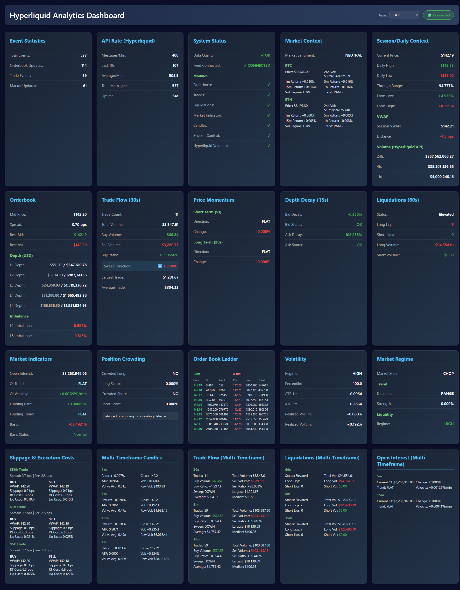

# Hyperliquid Analytics Dashboard

A real-time market analytics dashboard for Hyperliquid perpetual futures, providing comprehensive market microstructure insights across 184 perpetual contracts with dynamic cryptocurrency selection.



## Architecture

```
Hyperliquid (WebSocket + REST API) → Backend API → Frontend Dashboard
```

- **Hyperliquid**: Provides real-time WebSocket market data (orderbook, trades, liquidations) and REST API data (candles, volumes, market indicators)
- **Backend API**: FastAPI server that processes market data and calculates analytics
- **Frontend**: React/TypeScript dashboard displaying real-time analytics

## Features

### Multi-Asset Support
- **184 Perpetual Contracts**: Track any active perpetual on Hyperliquid
- **Dynamic Coin Selector**: Switch between assets in real-time via dropdown
- **Clean Transitions**: Automatically unsubscribes from old asset and subscribes to new one
- **Organized List**: BTC, ETH, SOL prioritized at top, then alphabetically sorted

### Cross-Asset Market Context
- **BTC/ETH Tracking**: Real-time price movements and returns (1m, 5m, 15m, 1h)
- **Volatility Regime**: Low/normal/high volatility classification for major assets
- **Trend Regime**: Up/down/range trend detection for broader market context
- **Market Sentiment**: Aggregated bullish/bearish/neutral/mixed sentiment indicator

### Market Data
- **Order Book Analytics**: Mid price, spread, depth imbalances (L1-L5), bid/ask liquidity
- **Trade Flow**: Multi-timeframe trade volume, buy/sell ratios, sweep detection
- **Liquidations**: Long/short liquidation tracking across multiple timeframes
- **Market Indicators**: Open Interest, funding rates, perp-spot basis

### Advanced Analytics
- **Session Context**: Daily high/low, VWAP, distance from VWAP, volume statistics
- **Volatility Metrics**: ATR and realized volatility across multiple timeframes
- **Position Crowding**: Detects crowded long/short positions using OI, funding, and basis
- **Market Regime**: Identifies trend regime (up/down/range), liquidity regime (high/normal/thin), and market conditions (normal/trend/chop/liquidation/squeeze/crash)
- **Slippage Estimates**: Calculates execution costs for different trade sizes ($100-$10k)

### System Monitoring
- **Data Quality Monitoring**: Real-time health checks for all data modules
- **Feed Connection Status**: Tracks orderbook freshness and WebSocket connectivity
- **Module Health**: Individual status indicators for orderbook, trades, liquidations, market indicators, candles, session context, and Hyperliquid volumes

## Project Structure

```
signal_only/
├── backend/
│   ├── api_server.py                    # Main FastAPI server with WebSocket analytics endpoint
│   ├── hyperliquid_client.py            # WebSocket client for Hyperliquid market data
│   ├── transport_hyperliquid_sdk.py     # Transport layer for Hyperliquid SDK
│   ├── models.py                        # Data models for market events
│   ├── config.py                        # Configuration settings
│   │
│   ├── Core Analytics Modules:
│   ├── orderbook_metrics.py             # Order book depth and imbalance analysis
│   ├── trade_flow_tracker.py            # Trade flow statistics and sweep detection
│   ├── liquidations.py                  # Liquidation tracking and analysis
│   ├── market_indicators.py             # Open Interest, funding rates, basis tracking
│   ├── candle_aggregator.py             # OHLCV candle aggregation (1m, 5m, 15m, 1h)
│   ├── candle_fetcher.py                # Historical candle data fetching
│   ├── volatility.py                    # Volatility metrics (ATR, realized vol)
│   ├── session_context.py               # Daily high/low, VWAP, volume tracking
│   │
│   ├── Advanced Analytics:
│   ├── crowding_detector.py             # Position crowding detection
│   ├── regime_detector.py               # Market regime classification
│   ├── slippage_estimator.py            # Execution cost estimation
│   ├── cross_asset_context.py           # BTC/ETH cross-asset tracking & sentiment
│   ├── price_momentum.py                # Price momentum indicators
│   ├── depth_decay.py                   # Order book depth decay analysis
│   │
│   ├── Utilities & Tools:
│   ├── rate_limit_tracker.py            # API rate limiting
│   ├── get_symbols.py                   # Fetch available perpetual symbols
│   ├── database/                        # Database models and connection
│   │   ├── __init__.py
│   │   ├── models.py
│   │   └── connection.py
│   │
│   └── Testing & Debugging Scripts:
│       ├── run_live.py                  # Live trading data collection
│       ├── run_live_with_tracking.py    # Live data with rate limit tracking
│       ├── run_full_analytics.py        # Full analytics testing
│       ├── run_enhanced_analytics.py    # Enhanced analytics testing
│       ├── run_latency_test.py          # WebSocket latency testing
│       ├── run_candle_debug.py          # Candle aggregation debugging
│       ├── run_1min_api_count.py        # API call counting
│       └── measure_rest_usage.py        # REST API usage measurement
│
├── frontend/
│   ├── src/
│   │   ├── Dashboard.tsx                # Main dashboard component with coin selector
│   │   ├── useWebSocket.ts              # WebSocket connection hook
│   │   ├── types.ts                     # TypeScript type definitions
│   │   ├── App.tsx                      # Root application component
│   │   ├── index.tsx                    # Application entry point
│   │   └── vite-env.d.ts                # Vite environment types
│   │
│   ├── public/                          # Static assets
│   ├── build/                           # Production build output
│   ├── package.json                     # NPM dependencies
│   ├── vite.config.ts                   # Vite build configuration
│   ├── tsconfig.json                    # TypeScript configuration
│   └── tsconfig.node.json               # TypeScript Node config
│
├── Docker Configuration:
├── docker-compose.yml                   # Docker orchestration (backend, frontend, nginx)
├── Dockerfile.backend                   # Backend container definition
├── Dockerfile.frontend                  # Frontend container definition
│
├── Documentation:
├── README.md                            # This file
└── LICENSE                              # Apache 2.0 License
```

## Getting Started

### Prerequisites
- Docker & Docker Compose

### Running with Docker

1. **Start the services**:
   ```bash
   docker-compose up -d
   ```

2. **Access the dashboard**:
   - Frontend: http://localhost:3000
   - Backend API: http://localhost:8001
   - WebSocket: ws://localhost:8001/ws/analytics

3. **View logs**:
   ```bash
   docker-compose logs -f backend
   docker-compose logs -f frontend
   ```

4. **Stop the services**:
   ```bash
   docker-compose down
   ```

### Configuration

The dashboard supports dynamic coin selection via the frontend dropdown. To configure the network:

Edit `backend/config.py`:
```python
USE_MAINNET = True    # Set to False for testnet
```

Environment variables in `docker-compose.yml`:
```yaml
environment:
  - HYPERLIQUID_NETWORK=mainnet  # or 'testnet'
```

## API Endpoints

### REST
- `GET /` - Health check
- `GET /health` - System health status

### WebSocket
- `ws://localhost:8001/ws/analytics?coin=<SYMBOL>` - Real-time analytics stream for specific coin

**Parameters:**
- `coin` (optional): Cryptocurrency symbol (e.g., BTC, ETH, SOL). Defaults to SOL if not specified.

**Example:**
```javascript
// Connect to BTC analytics
const ws = new WebSocket('ws://localhost:8001/ws/analytics?coin=BTC');

// Switch to ETH by creating new connection
const ws2 = new WebSocket('ws://localhost:8001/ws/analytics?coin=ETH');
```

The WebSocket sends JSON updates every ~1 second containing:
- Order book data (mid price, spread, depth imbalances L1-L5)
- Trade flow statistics (multi-timeframe volume, buy/sell ratios)
- Liquidation data (long/short liquidations across timeframes)
- Market indicators (Open Interest, funding rates, perp-spot basis)
- Candle metrics (1m, 5m, 15m, 1h OHLCV data)
- Volatility metrics (ATR, realized volatility)
- Session context (daily high/low, VWAP, volumes)
- Cross-asset context (BTC/ETH price movements, volatility regime, trend regime, market sentiment)
- Position crowding flags (crowded longs/shorts detection)
- Market regime classification (trend/liquidity/market condition)
- Slippage estimates (execution costs for various trade sizes)
- System status (data quality, feed health, module status)

## Analytics Modules

### Cross-Asset Context Tracker
Monitors broader market conditions by tracking BTC and ETH:
- **Price Movements**: Real-time returns across 1m, 5m, 15m, 1h intervals
- **Volatility Regime**: Classifies market volatility as low/normal/high
- **Trend Regime**: Identifies trend direction (up/down/range)
- **Market Sentiment**: Aggregates overall market mood (bullish/bearish/neutral/mixed)

Helps traders understand if their coin's price action is aligned with or diverging from major market movers.

### Session Context Tracker
Tracks intraday market context for the selected coin:
- Daily high/low and current position in range
- Session VWAP and distance from VWAP
- Volume statistics (session, 1h, 4h, 24h from Hyperliquid API)

### Crowding Detector
Identifies crowded positions based on:
- Open Interest trends and velocity
- Funding rate levels and trends
- Perp-spot basis

Provides crowding scores (0-1) and interpretations for both long and short positions.

### Regime Detector
Classifies market conditions:
- **Trend Regime**: up/down/range based on price action
- **Liquidity Regime**: high/normal/thin based on order book depth
- **Market Regime**: normal/trend/chop/liquidation_event/short_squeeze/crash

### Slippage Estimator
Calculates execution costs for trade sizes ($100, $500, $1000, $5000, $10000):
- Average fill price
- Slippage in basis points
- Round-trip cost including fees
- Feasibility check
- Liquidity utilization percentage

## Development

### Backend Development

```bash
# Install dependencies
pip install -r backend/requirements.txt

# Run backend locally (without Docker)
cd backend
python api_server.py
```

### Frontend Development

```bash
# Install dependencies
cd frontend
npm install

# Run development server
npm run dev

# Build for production
npm run build
```

### Running Tests

```bash
# Backend tests
python -m unittest discover -s tests
```

## Technical Details

### Data Flow
1. **Frontend Dropdown**: User selects cryptocurrency from 184 available perpetual contracts
2. **WebSocket Connection**: Frontend establishes WebSocket connection with `?coin=<SYMBOL>` parameter
3. **Per-Connection Resources**: Backend creates dedicated analytics engine and Hyperliquid client for each connection
4. **Hyperliquid WebSocket**: Streams real-time orderbook, trades, and liquidations for selected coin
5. **Hyperliquid REST API**: Provides candles, 24h volumes, OI, funding rates
6. **Cross-Asset Tracking**: Separate BTC/ETH trackers monitor broader market context
7. **Backend Processing**: Aggregates data into analytics using various trackers/detectors
8. **FastAPI WebSocket**: Broadcasts analytics updates to connected clients every ~1 second
9. **React Frontend**: Displays analytics in responsive dashboard with real-time updates

### Architecture Highlights
- **Multi-Asset Support**: Each WebSocket connection handles one cryptocurrency independently
- **Clean Switching**: Changing coins closes old connection and opens new one cleanly
- **Resource Management**: Automatic cleanup of analytics engines and clients on disconnect
- **Cross-Asset Context**: Always tracks BTC/ETH regardless of selected coin for market context

### Performance
- WebSocket analytics updates every ~1 second
- Order book analysis on every market data update
- Trade flow tracked with configurable windows (10s, 1m, 5m, 15m)
- Candle aggregation for 1m, 5m, 15m, 1h intervals
- Market indicator updates rate-limited to 60s intervals
- Hyperliquid volume fetching rate-limited to 60s intervals
- Cross-asset context (BTC/ETH) updates every 1-5 seconds
- Frontend state cleared on coin switch to prevent stale data display

### Monitoring
The system includes comprehensive health monitoring:
- Data freshness checks (orderbook < 5s, trades < 60s, market data < 120s)
- Module availability checks
- Connection status tracking
- Overall data quality assessment

## License

This project is licensed under the Apache License 2.0 - see the [LICENSE](LICENSE) file for details.

Copyright 2025 Hyperliquid Analytics Dashboard

Licensed under the Apache License, Version 2.0 (the "License");
you may not use this file except in compliance with the License.
You may obtain a copy of the License at

    http://www.apache.org/licenses/LICENSE-2.0

Unless required by applicable law or agreed to in writing, software
distributed under the License is distributed on an "AS IS" BASIS,
WITHOUT WARRANTIES OR CONDITIONS OF ANY KIND, either express or implied.
See the License for the specific language governing permissions and
limitations under the License.
